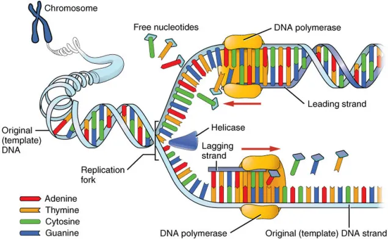
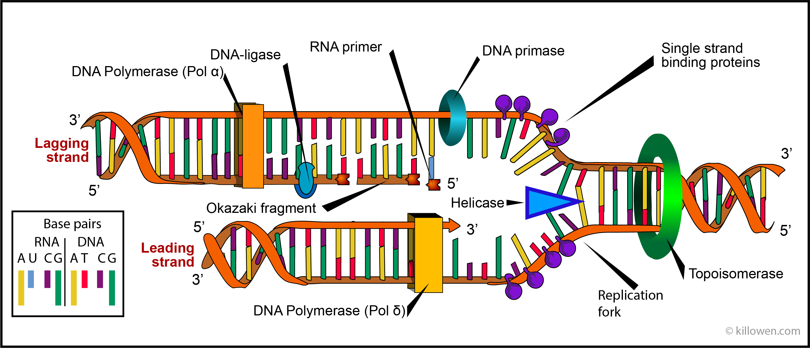
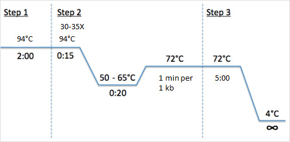
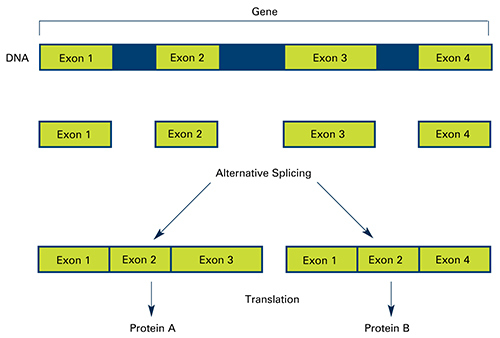
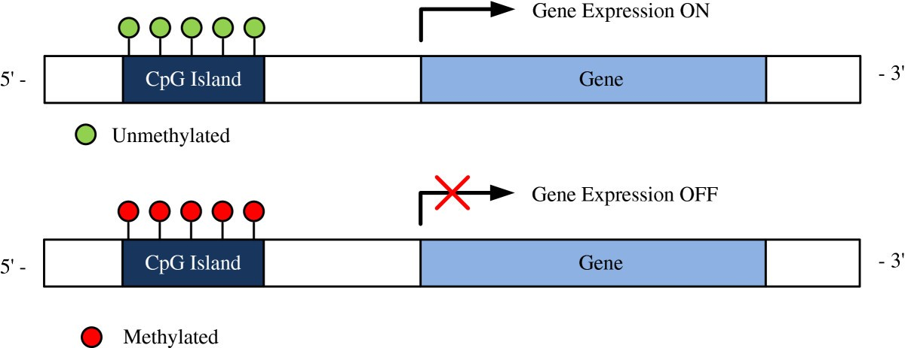
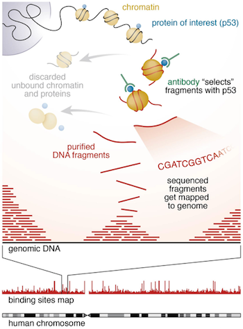
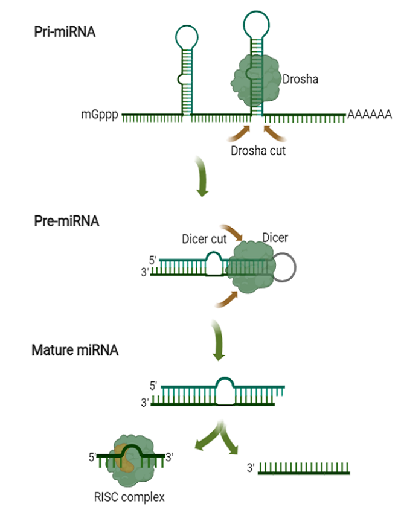

## Sobre este minicurso

-   Duração: **19h00 – 21h00** (remoto)
-   Foco: princípios técnicos + prática guiada com ferramentas gratuitas
-   Audiência mista: vamos do zero até casos aplicados de pesquisa
-   Exemplos práticos em **5 contextos diferentes**:
    1.  DNA genômico
    2.  RT‑qPCR
    3.  ChIP‑qPCR
    4.  mePCR (enzimas sensíveis à metilação)
    5.  miRNA

## Objetivos de aprendizagem

Ao final deste minicurso, você será capaz de:

-   Explicar os critérios físico-químicos que definem um bom primer;
-   Buscar sequências-alvo em bancos de dados públicos (NCBI, Ensembl, UCSC, miRBase);
-   Desenhar e validar primers usando Primer3Plus, Primer‑BLAST e OligoAnalyzer;
-   Adaptar o desenho de primers a diferentes aplicações experimentais;

## Sobre mim

::::: columns
::: {.column width="50%"}
{fig-align="left" width="420"}
:::

::: {.column width="50%" style="font-size: 80%;"}
-   Marcel;

 

-   Físico médico;

 

-   Me e PhD em Biotecnologia;

 

-   Desde 2023, pós-doutorado em genética;
:::
:::::

# Bloco 1 - Fundamentos de Biologia Molecular {background-color="#1b3a4b"}

## Dogma central da biologia molecular

[{fig-align="center"}](https://www.geeksforgeeks.org/biology/central-dogma-steps-guide/)

## Replicação do DNA

[{fig-align="center" width="850"}](https://allinonehighschool.com/dna-replication/)

## Replicação do DNA

[{fig-align="center"}](https://www.killowen.com/genetics1D.html)

## Reação em Cadeia da Polimerase

. . .

::::: columns
::: {.column width="50%"}
{fig-align="center" width="450"}
:::

::: {.column width="50%"}
-   Kary B. Mullis;

-   Criou em 1983/85 a PCR;

-   Nobel 1993;
:::
:::::

## O que é a PCR? {.smaller}

::::: columns
::: {.column width="50%" layout-align="center"}
{.r-stretch fig-align="right"}
:::

::: {.column width="50%"}
-   Reação em Cadeia da Polimerase: amplificação exponencial de uma região específica de DNA
-   Três etapas por ciclo:
    1.  Desnaturação (\~94–98 °C) — separa as fitas;
    2.  Anelamento (\~50–65 °C) — primers pareiam com o molde;
    3.  Extensão (\~72 °C) — DNA polimerase sintetiza a nova fita;
-   Repetido por 25–40 ciclos → "amplificação exponencial";
:::
:::::

## Reação em Cadeia da Polimerase - Tipos

[{fig-align="center" width="720"}](https://www.linkedin.com/posts/er-anurag-rathore-a1793222a_pcr-molecularbiology-biotech-activity-7340759751368089600-4ueM)

## Por que precisamos de primers?

-   DNA polimerases **não iniciam síntese do zero;**
-   Precisam de uma extremidade 3'-OH livre para começar a adicionar nucleotídeos;
-   O primer fornece esse ponto de partida, pareando com o molde;
-   Síntese sempre ocorre **5' → 3';**

## Anatomia de um par de primers

.png){fig-align="center" width="720"}

-   **Forward**: idêntico à fita senso, na extremidade 5' do alvo;
-   **Reverse**: complementar reverso da fita senso, na extremidade 3' do alvo;
-   Juntos, delimitam o **amplicon**;

## Tipos de molde (template)

-   **DNA genômico (gDNA)**: dupla-fita, contém íntrons, regiões repetitivas, ambos os alelos;
-   **cDNA**: gerado por transcrição reversa a partir de mRNA — sem íntrons;
-   **DNA digerido/tratado**: bisulfito, enzimas de restrição sensíveis à metilação;
-   **Cromatina imunoprecipitada (ChIP)**: fragmentos ligados a uma proteína de interesse;
-   Cada tipo de molde impõe **restrições específicas** ao desenho do primer;

## Dogma central (revisão rápida)

DNA → (transcrição) → RNA → (tradução) → Proteína

-   Relevante para **RT‑qPCR**: medimos RNA convertido em cDNA;
-   Genes têm **éxons** (codificantes, permanecem no mRNA maduro) e **íntrons** (removidos por splicing);
-   Primers para RT‑qPCR idealmente atravessam **junções éxon‑éxon**;

## Splicing

[{fig-align="center" width="750"}](https://www.insideprecisionmedicine.com/wp-content/uploads/2019/01/623.jpeg)

## Metilação do DNA e ilhas CpG {.smaller}

-   Metilação ocorre predominantemente em **dinucleotídeos CpG**;
-   **Ilhas CpG**: regiões ricas em CpG, frequentemente em promotores;
-   Metilação de promotor geralmente associada a **silenciamento gênico**;
-   Algumas enzimas de restrição são **sensíveis à metilação** do seu sítio de corte;
-   Base para o método de **mePCR** que veremos no Bloco 5;

[{fig-align="center" width="800"}](https://link.springer.com/article/10.1186/1687-4153-2012-12)

## ChIP-seq: o essencial {.smaller}

::::: columns
::: {.column width="50%"}
[{fig-align="center" width="450"}](https://www.google.com/imgres?q=chip%20seq&imgurl=https%3A%2F%2Fhbctraining.github.io%2FIntro-to-ChIPseq%2Fimg%2Fchipseq_overall.png&imgrefurl=https%3A%2F%2Fhbctraining.github.io%2FIntro-to-ChIPseq%2Flessons%2F01_Intro_chipseq_data_organization.html&docid=6zrpjz4wiJe1EM&tbnid=a9lb95GtwZNhEM&vet=12ahUKEwja7frlqIKXAxV4GrkGHVTeHpYQnPAOegQIRxAA..i&w=350&h=474&hcb=2&ved=2ahUKEwja7frlqIKXAxV4GrkGHVTeHpYQnPAOegQIRxAA)
:::

::: {.column width="50%"}
-   **Chromatin Immunoprecipitation** + sequenciamento;
-   Objetivo: mapear onde uma proteína (fator de transcrição, marca de histona) se liga ao DNA;
-   Gera **picos (peaks)** — coordenadas genômicas de enriquecimento;
-   **ChIP‑qPCR** é usado para *validar* um pico específico com primers direcionados;
:::
:::::

## miRNA: o essencial {.smaller}

::::: columns
::: {.column width="50%"}
-   MicroRNAs: RNAs não codificantes, **\~19–24 nt**, reguladores pós-transcricionais;
-   Biogênese: pri‑miRNA → pré‑miRNA (hairpin) → miRNA maduro;
-   Desafio para PCR: **o alvo é curto demais** para um par de primers convencional;
-   Exige estratégias específicas (RT com stem‑loop ou poly‑A tailing) — Bloco 5;
:::

::: {.column width="50%"}
[{fig-align="center" width="450"}](https://www.origene.com/products/rnai/microrna-expression-plasmids)
:::
:::::

# Bloco 2 - Critérios Técnicos de Desenho de Primers {background-color="#1b3a4b"}

## Comprimento do primer

-   Faixa recomendada: **18–24 nucleotídeos**;
-   Curto demais → perde especificidade (mais sítios de pareamento aleatório);
-   Longo demais → maior chance de estruturas secundárias, custo maior;
-   Regra prática: comprimento suficiente para Tm adequada dentro da faixa ideal;

## Temperatura de melting (Tm) — conceito

-   Temperatura em que **50% das moléculas** de primer estão pareadas ao molde
-   Depende de: comprimento, composição de bases, concentração de sal e de primer
-   Temperatura de anelamento da PCR normalmente é **Tm − 3 a 5 °C**
-   Base para escolher a temperatura de anelamento do protocolo

## Tm — fórmulas de cálculo

::::: columns
::: {.column width="50%"}
**Regra de Wallace** (primers curtos, \<14 nt)

$$Tm = 4(G+C) + 2(A+T)$$

-   Simples, mas pouco precisa
:::

::: {.column width="50%"}
**Método %GC**

$$Tm = 64.9 + 41 \times \frac{(GC - 16.4)}{N}$$

-   Melhor para primers médios
:::
:::::

. . .

**Nearest-neighbor (termodinâmico)**

-   Considera energia livre de pares de bases vizinhos;
-   Padrão-ouro, usado por Primer3, OligoAnalyzer, Primer-BLAST;

## Conteúdo de GC

-   Faixa ideal: **40–60% GC**;
-   GC muito baixo → Tm baixa, pareamento fraco;
-   GC muito alto → risco de estruturas secundárias, Tm alta demais;
-   **GC clamp**: 1–2 G ou C nos últimos 5 nt da extremidade 3' — estabiliza o anelamento final;

## Diferença de Tm entre o par F/R

-   Primers forward e reverse devem ter **Tm semelhante**;
-   Diferença ideal: **≤ 2–3 °C** (tolerável até \~5 °C);
-   Se muito diferente, um primer anela bem enquanto o outro não → eficiência cai;
-   A maioria das ferramentas já otimiza isso automaticamente;

## Especificidade

-   O primer deve se ligar **apenas** ao sítio-alvo pretendido no genoma/transcriptoma;
-   Falta de especificidade → produtos inespecíficos, bandas extras, sinal falso em qPCR;
-   Verificação obrigatória: **BLAST** da sequência do primer contra o genoma/transcriptoma de interesse;
-   Atenção redobrada em: famílias gênicas, pseudogenes, regiões repetitivas;

## Estruturas secundárias — hairpin

-   Dobramento intramolecular do próprio primer;
-   Bases complementares dentro da mesma sequência formam uma "grampo";
-   Compromete a disponibilidade do primer para parear com o molde;
-   Avaliado por energia livre (ΔG); hairpins estáveis (ΔG muito negativo) são problemáticos;

## Estruturas secundárias — dímeros

-   **Self-dimer**: duas cópias do mesmo primer se pareiam entre si;
-   **Heterodimer (cross-dimer)**: primer forward pareia com o reverse;
-   Especial atenção às **extremidades 3'** — dímero na ponta 3' é o pior cenário (gera produto "primer-dimer");
-   Consome reagentes e compete com a amplificação do alvo real;

## Extremidade 3' — por que importa tanto

-   É onde a DNA polimerase **inicia a extensão**;
-   Deve ser **livre de estruturas secundárias**;
-   Evitar terminar em **T** (menos estável) — preferir G ou C (mas sem exagerar, cuidado com GC clamp excessivo);
-   Evitar complementaridade com o outro primer nessa região;

## Repetições e runs de mononucleotídeos

-   Evitar sequências como `AAAAA` ou `GGGGG` (\>4 repetições);
-   Aumentam risco de pareamento inespecífico e "slippage" da polimerase;
-   Evitar dinucleotídeos repetidos longos (ex. `CACACACA`);

## Tamanho do amplicon

| Aplicação                       | Tamanho recomendado |
|---------------------------------|---------------------|
| PCR convencional / Sanger       | 200–1000 pb         |
| qPCR (SYBR/TaqMan)              | 70–200 pb           |
| ChIP-qPCR                       | 80–200 pb           |
| mePCR (pós-digestão enzimática) | 150–400 pb          |

-   Amplicons curtos → maior eficiência em qPCR;
-   Amplicons muito curtos (\<50 pb) dificultam distinção de dímeros de primer;

## Checklist resumido

::: incremental
-   ✅ Comprimento 18–24 nt
-   ✅ Tm entre 55–65 °C, com ΔTm entre o par ≤ 3 °C
-   ✅ GC 40–60%, GC clamp na extremidade 3'
-   ✅ Especificidade confirmada por BLAST
-   ✅ Sem hairpins/dímeros estáveis, especialmente na ponta 3'
-   ✅ Sem repetições de mononucleotídeos
-   ✅ Amplicon no tamanho adequado à aplicação
:::

# Bloco 3 - Bancos de Dados Computacionais {background-color="#1b3a4b"}

## NCBI

-   **Gene**: informações sobre genes (localização, isoformas, literatura);
-   **Nucleotide**: sequências de DNA/RNA em formato FASTA;
-   **Genome / Assembly**: montagens genômicas de referência (ex. GRCh38);
-   **RefSeq**: sequências de referência curadas (NM\_, NR\_, NC\_...);
-   Ponto de partida para obter a sequência-alvo de quase qualquer aplicação;

## Ensembl

-   Alternativa ao NCBI, com forte integração de anotação e ferramentas comparativas;
-   Interface amigável para visualizar transcritos, éxons/íntrons, variantes;
-   **BioMart**: extração em lote de sequências e anotações;
-   Útil para conferir isoformas alternativas de splicing (importante em RT-qPCR);

## UCSC Genome Browser

-   Visualização integrada de múltiplas camadas de anotação simultaneamente
-   Tracks úteis para este curso:
    -   **Ilhas CpG** (para mePCR);
    -   **RepeatMasker** (evitar regiões repetitivas);
    -   **ENCODE ChIP-seq peaks** (para ChIP-qPCR);
    -   **Common SNPs** (evitar polimorfismos na região do primer);
-   Permite extrair sequência de qualquer região visualizada (DNA tool);

## miRBase

-   Banco de dados de referência para **microRNAs**;
-   Fornece sequência do **pré-miRNA** (hairpin) e do **miRNA maduro**;
-   Nomenclatura padronizada (ex. hsa-miR-21-5p);
-   Essencial antes de desenhar qualquer primer relacionado a miRNA;

## ENCODE / Cistrome DB

-   **ENCODE**: repositório de dados funcionais, incluindo milhares de experimentos de ChIP-seq;
-   **Cistrome DB**: curadoria de dados de ChIP-seq/ATAC-seq para fatores de transcrição;
-   Permitem localizar **coordenadas de picos** publicados para um fator/marca de interesse;
-   Ponto de partida para desenhar primers de validação por ChIP-qPCR;

## REBASE e enzimas de restrição

-   **REBASE**: banco de dados de enzimas de restrição e seus sítios de reconhecimento;
-   Ferramentas como **NEBcutter** identificam sítios de corte em uma sequência;
-   Essencial para localizar sítios sensíveis à metilação (ex. `CCGG` — HpaII/MspI);
-   Passo obrigatório antes do desenho de primers para mePCR;

## Boas práticas ao obter sequências

::: incremental
-   Confirme sempre o **genome build** (ex. GRCh38 vs. hg19) — coordenadas não são intercambiáveis;
-   Verifique se a sequência é da **fita correta** (senso vs. antissenso);
-   Cheque a presença de **SNPs comuns** na região onde os primers serão colocados;
-   Para RT-qPCR, confirme a **estrutura éxon-íntron** do transcrito de interesse;
-   Salve sempre a sequência em formato **FASTA** para uso nas ferramentas de desenho;
:::

## Resumo — banco de dados por aplicação

| Aplicação    | Banco de dados principal                |
|--------------|-----------------------------------------|
| DNA genômico | NCBI Gene/Nucleotide, Ensembl, UCSC     |
| RT-qPCR      | NCBI RefSeq (mRNA), Ensembl (isoformas) |
| ChIP-qPCR    | ENCODE, Cistrome DB, UCSC (peaks)       |
| mePCR        | UCSC (ilhas CpG), REBASE/NEBcutter      |
| miRNA        | miRBase                                 |

# Bloco 4 - Ferramentas Online Gratuitas {background-color="#1b3a4b"}

## Primer3 / Primer3Plus

-   Motor de desenho de primers mais usado no mundo acadêmico (open source);
-   **Primer3Plus**: interface web amigável sobre o mecanismo Primer3;
-   Parâmetros ajustáveis: Tm, GC%, comprimento, tamanho do amplicon, evitar SNPs;
-   Não faz BLAST automaticamente — é preciso conferir especificidade à parte;

## NCBI Primer-BLAST

-   Combina o motor **Primer3** com **BLAST integrado** contra o genoma/transcriptoma;
-   Permite restringir a busca a um organismo específico;
-   Opção crucial para RT-qPCR: **"Exon junction span"** e **"exclude templates from genomic DNA"**;
-   Resultado já indica produtos inespecíficos previstos — grande economia de tempo;

## OligoAnalyzer (IDT)

-   Ferramenta gratuita da Integrated DNA Technologies;
-   Calcula: Tm (nearest-neighbor), % GC, hairpins, self-dimers, heterodimers;
-   Ideal para **validar** primers já desenhados manualmente ou por outra ferramenta;
-   Permite simular o par completo (F + R) para checar heterodimerização;

## Ferramentas específicas — RT-qPCR

-   **NCBI Primer-BLAST** com "intron inclusion" ativado (força spanning de junção);
-   **IDT PrimerQuest / RealTime PCR tool**: já otimizado para amplicons curtos;
-   Sempre conferir a estrutura éxon-íntron no Ensembl/UCSC antes de desenhar;

## Ferramentas específicas — ChIP-qPCR

-   Não há ferramenta "dedicada" — o fluxo é:
    1.  Obter coordenadas do pico (ENCODE/Cistrome ou dados próprios)
    2.  Extrair sequência flanqueadora no UCSC/Ensembl
    3.  Desenhar com Primer3Plus/Primer-BLAST centrado no pico
-   Desenhar também primers de **região controle** (sem enriquecimento esperado)

## Ferramentas específicas — mePCR

-   **MethPrimer**: focado em primers para PCR pós-bissulfito (contexto diferente do nosso exemplo);
-   Para **MSRE-PCR** (enzimas sensíveis à metilação): NEBcutter/REBASE para localizar sítios, depois Primer3Plus para desenhar primers **flanqueando** (não sobrepondo) o sítio de corte;
-   Sem essa etapa de mapeamento do sítio, o experimento não funciona;

## Ferramentas específicas — miRNA

-   **miRBase**: obtenção da sequência madura/pré-miRNA;
-   **miRPrimer2**: ferramenta dedicada a primers para RT-qPCR de miRNA (método SYBR com poly-A tailing);
-   Abordagem alternativa: primer stem-loop específico (método tipo TaqMan, Chen *et al.* 2005);
-   Atenção redobrada a famílias com alta similaridade (ex. família let-7);

## Comparativo das ferramentas

| Ferramenta | Função principal | Especificidade integrada? |
|----|----|----|
| Primer3Plus | Desenho geral | Não |
| NCBI Primer-BLAST | Desenho + checagem | Sim |
| OligoAnalyzer (IDT) | Validação (Tm, dímeros, hairpin) | Não |
| miRPrimer2 | Desenho para miRNA | Parcial |
| NEBcutter/REBASE | Mapeamento de sítios de restrição | — |

## Fluxo de trabalho geral

::: incremental
1.  Obter a sequência-alvo no banco de dados apropriado (FASTA)
2.  Definir parâmetros no Primer3Plus/Primer-BLAST conforme a aplicação
3.  Gerar candidatos a primers
4.  Checar especificidade (BLAST, se não integrado)
5.  Validar Tm, GC%, estruturas secundárias no OligoAnalyzer
6.  Selecionar o par final e documentar
:::

# Bloco 5 - Exemplos Práticos Aplicados {background-color="#1b3a4b"}

## Panorama dos 5 exemplos

| \# | Aplicação | Desafio principal |
|----|----|----|
| 1 | DNA genômico | Especificidade, evitar SNPs/repeats |
| 2 | RT-qPCR (GAPDH) | Spanning de junção éxon-éxon |
| 3 | ChIP-qPCR | Amplificar região exata do pico |
| 4 | mePCR (enzimas metil-sensíveis) | Flanquear o sítio de corte |
| 5 | miRNA | Alvo curto demais para par convencional |

------------------------------------------------------------------------

# Exemplo 1 — DNA genômico {background-color="#2c5f6f"}

## Contexto

-   Objetivo: amplificar uma região genômica (ex. um éxon ou promotor) para genotipagem/Sanger;
-   Molde: DNA genômico total (dsDNA), ambos os alelos presentes;
-   Situação típica: validação de um SNP, inserção, ou clonagem de uma região regulatória;

## Passo a passo

::: incremental
1.  Obter a sequência genômica no **NCBI Gene** ou **UCSC** (formato FASTA);
2.  Definir a região-alvo (ex. ±300 pb ao redor do SNP/inserção de interesse);
3.  Rodar **Primer3Plus** ou **Primer-BLAST** com parâmetros padrão de PCR convencional;
4.  Conferir no **UCSC** se há SNPs comuns ou repeats sobrepondo os primers propostos;
5.  Validar Tm/GC/dímeros no **OligoAnalyzer**;
:::

## Pontos de atenção específicos

-   Amplicon maior é aceitável (200–1000 pb) — não há restrição de eficiência de qPCR;
-   Cuidado redobrado com **regiões repetitivas** (track RepeatMasker no UCSC);
-   Evitar posicionar primers sobre **SNPs comuns** (track Common SNPs) — pode causar falha de anelamento em alguns alelos;
-   Se o objetivo for genotipagem por Sanger, considerar posicionar primers **fora** da região de interesse, com boa margem;

------------------------------------------------------------------------

# Exemplo 2 — RT-qPCR (GAPDH) {background-color="#2c5f6f"}

## Contexto

-   GAPDH: gene de referência (*housekeeping*) clássico para normalização;
-   Molde: **cDNA**, sintetizado a partir de mRNA por transcrição reversa;
-   Sequência de referência: RefSeq mRNA, ex. `NM_002046`;

## O desafio central

-   DNA genômico contaminante pode ser coamplificado se os primers estiverem dentro de um único éxon
-   Solução: desenhar primers que **atravessem uma junção éxon-éxon**
-   Assim, o amplicon só se forma a partir do **mRNA processado (splicing já ocorrido)**

## Passo a passo

::: incremental
1.  Buscar `NM_002046` (GAPDH) no **NCBI Nucleotide** ou visualizar estrutura no **Ensembl/UCSC**
2.  Identificar a posição das junções éxon-éxon no transcrito
3.  No **NCBI Primer-BLAST**, ativar a opção de **spanning de junção exon-exon**
4.  Restringir amplicon a **70–150 pb** (padrão qPCR)
5.  Validar especificidade contra o transcriptoma humano (não apenas genoma)
:::

## Pontos de atenção específicos

-   Verificar se há **isoformas alternativas** de GAPDH que devam (ou não) ser incluídas
-   Amplicon curto é essencial para eficiência de amplificação em qPCR
-   Sempre incluir um controle **"no-RT"** no experimento para confirmar ausência de amplificação de gDNA

------------------------------------------------------------------------